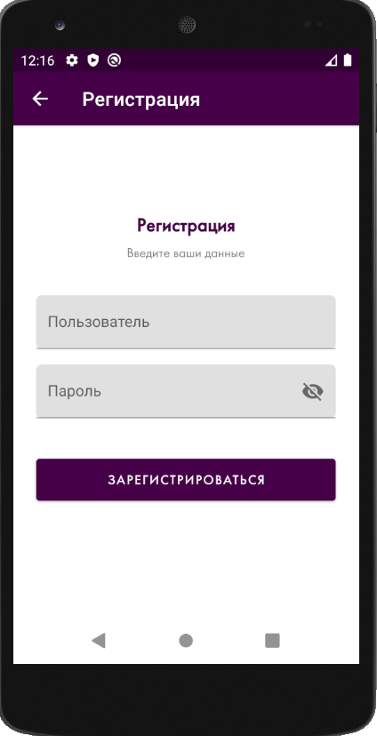
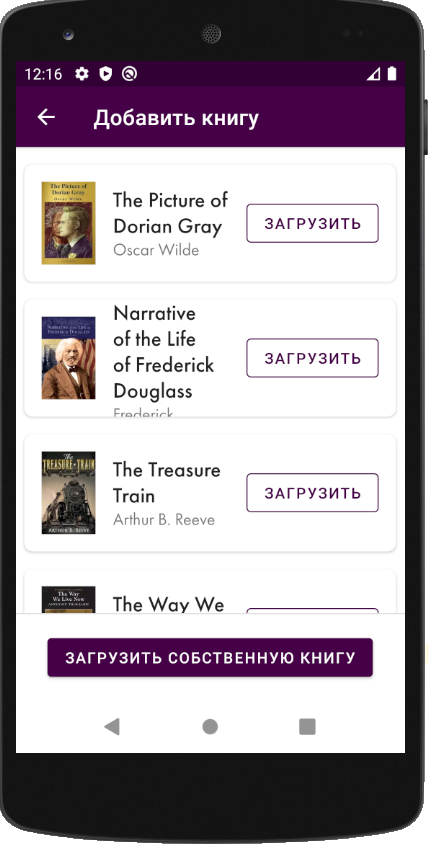
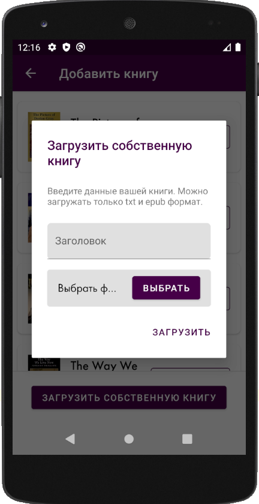
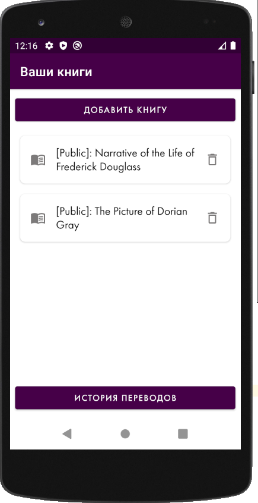
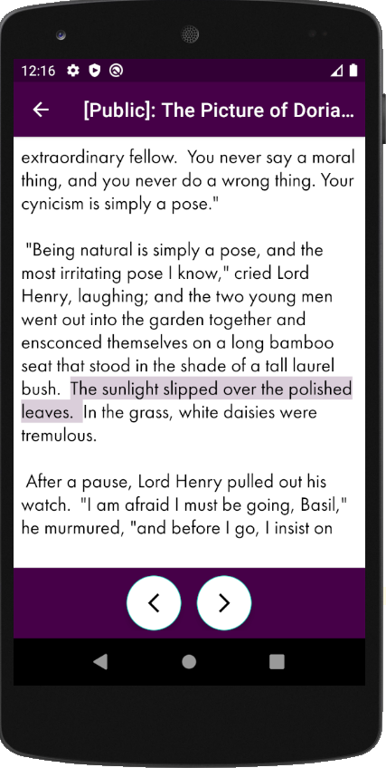
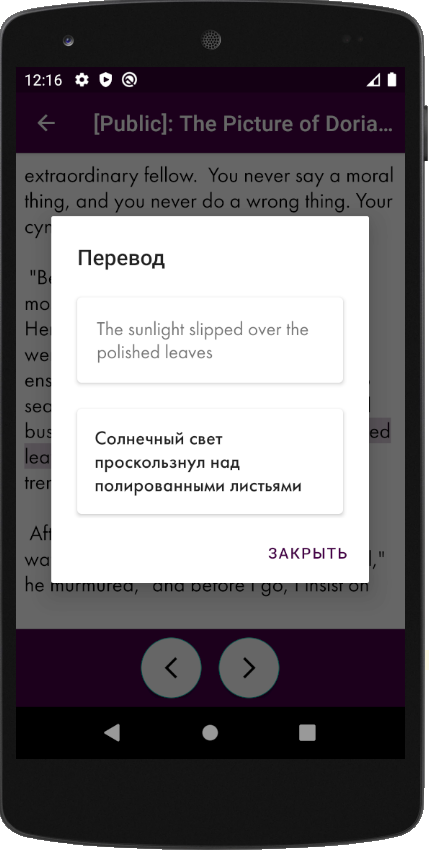
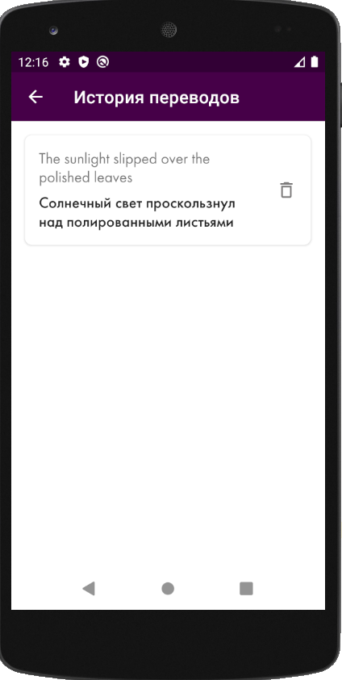
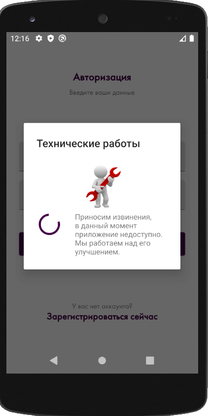

I am glad to introduce my first own project here in GitHub.

=== Application description ==

After downloading the application you should to create new account in date base (authorization process is the same):

After the registering you will see guide of using this application:

Guide explanation: Single click at work during the reading will show you translation of that word. Hold single word will select whole sentence for you.

After reading the guide you will be able to add your own or application's book into your phone:

After the adding books you'll see the main screen:

And now you are able to select your added book for reading!

In a reading mode as I said in the guide - you will be able to translate text to Russian.

After reading your favorite books you will be able to see your searching history:

If server will not be available, user'll see "technical work popup"

