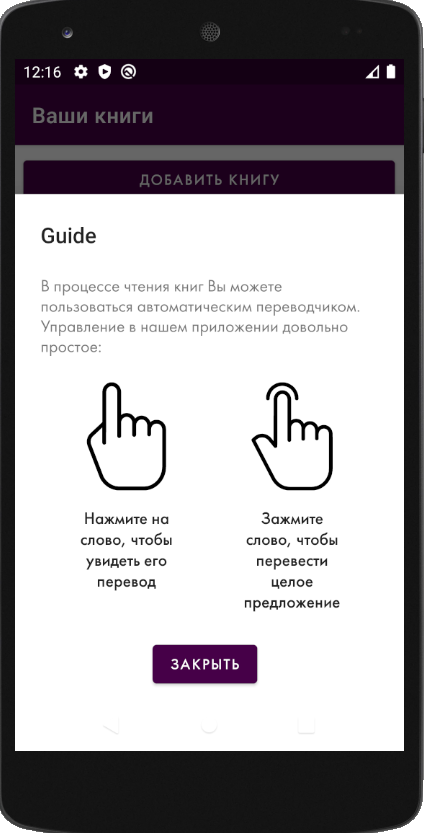

TODO:
- Remove API KEYS.

I am glad to introduce my first own project here in GitHub.

Application allows you to read the books and translate it during the reading (app also contains the mode for showing only English definition for a particular word) You should only change the API in Android application to Oxford Dictionary mode.

Functionality:
1) Oxford Translate Mode - show word's english definition.
2) Yandex Translate Mode - translate English -> Russian.
3) Public library - I added 5 public books for reading. User can download it by one click.
4) User library - user is able to upload his own book (parse and translate)
5) Translation history - user is able to show his history.
6) HealthCheck - server checks all services every 30 minutes. The android application checks server connection too and if it doesn't work shows technical work popup.

Here you can see an application architecture. I've used:
1) Postgres DB;
2) Mongo DB - it's not really necessary, because I could use only Postres DB with indexing.
3) Keycloak - same case here for education purpose, it could be simple Spring Security.
4) Docker-compose for fast build in new server (my docker support windows and linux versions)

Instruction for running server you'll find in server's readme.md
If you want to continue developing this application - you're welcome! I also added TODO list with important things to readme.

After downloading the application you should to create new account in date base (authorization process is the same):

After the registering you will see guide of using this application:

Guide explanation: Single click at work during the reading will show you translation of that word. Hold single word will select whole sentence for you.

After reading the guide you will be able to add your own or application's book into your phone:

After the adding books you'll see the main screen:

And now you are able to select your added book for reading!

In a reading mode as I said in the guide - you will be able to translate text to Russian.

After reading your favorite books you will be able to see your searching history:

If server will not be available, user'll see "technical work popup"

